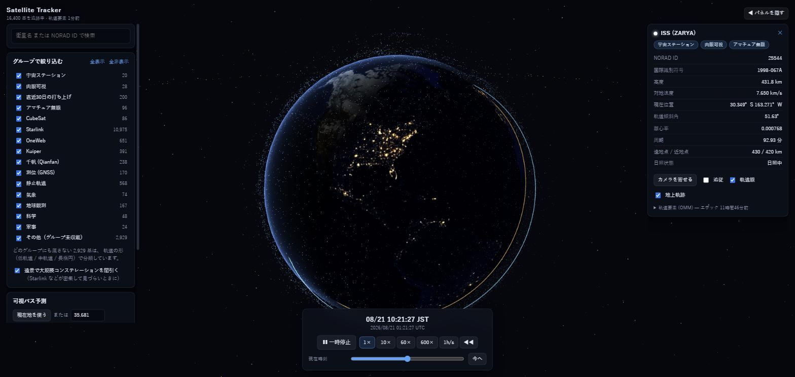

# Satellite Tracker

CelesTrak が公開している実測の軌道要素（GP データ）をもとに、いま地球を回っている人工衛星を
3D の地球の周りにリアルタイムで描画する Web アプリです。



- **実データ** — CelesTrak の `active` カタログ（16,400 基）を 2 時間ごとに取得
- **本物の軌道計算** — SGP4/SDP4（satellite.js、WASM 版）で伝播
- **グループ分類** — CelesTrak の公式グループ所属をそのまま使用（名前からの推測はしない）
- **Cloudflare Workers** — 無料プランのまま運用できる構成

---

## 動かす

```bash
npm install

# 地球テクスチャを取得（初回のみ。成果物はリポジトリに含まれています）
npm run textures

# ターミナル 1: API を担う Worker
npm run dev:worker      # http://127.0.0.1:8787

# ターミナル 2: フロントエンド（/api は上の Worker にプロキシされます）
npm run dev             # http://localhost:5173
```

初回は KV が空なので、`/api/gp` へのアクセス時に Worker が CelesTrak から取得して KV を埋めます。

---

## 設計

### なぜサーバを挟むのか

CelesTrak の `gp.php` は CORS を許可しているので、ブラウザから直接叩くことは技術的には可能です。
しかし **「1 更新サイクル（2 時間）につき GROUP ごとに 1 ダウンロード」** という制限があり、
2 回目以降は 403 が返ります（実際に確認済み。本文には
`GP data has not updated since your last successful download of GROUP=active` と書かれています）。

さらに 100MB/日 を超えると IP がブロックされ、403/404 を 2 時間に 50 回出しても同様です。
つまり**ブラウザ直叩きはリロード 2 回目で壊れる**ため、取得回数を構造的に 1 回へ固定する必要があります。

```
CelesTrak
   │  2時間に1回だけ（Cron Trigger）
   ▼
Cloudflare Worker ──▶ Workers KV ──▶ /api/gp ──▶ ブラウザ（何人来ても KV を読むだけ）
```

### なぜ集計を GitHub Actions でやるのか

Workers Free プランの CPU 上限は 10ms で、**これは Cron Trigger にも適用されます**
（`CPU time per Cron Trigger: Free 10 ms`）。2MB のテキストから NORAD ID を抜く処理は確実に超えます。

そこで、更新頻度と処理の重さで実行場所を分けました。

| データ | 中身 | 頻度 | 実行場所 | CelesTrak への転送量 |
|---|---|---|---|---|
| `gp:active` | 軌道要素 CSV | 2 時間ごと | Worker の Cron Trigger | 約 2.5MB × 12 = 30MB/日 |
| `groups:v1` | グループ所属のビットマスク | 1 日 1 回 | GitHub Actions | 約 2.0MB × 1 = 2MB/日 |

合計 約 32MB/日 で、CelesTrak の 100MB/日 制限に対して十分な余裕があります。
実行元 IP が分かれるため、片方の制限がもう片方に波及しないという副次的な利点もあります。

Worker がやるのは「fetch → `arrayBuffer()` → `KV.put()`」と「`KV.get(stream)` → そのまま返す」だけです。
`res.text()` を使わないのは、2.5MB の UTF-8 デコードだけで CPU 予算を使い切ってしまうためです。

### 形式に CSV を使う理由

TLE 系形式（3LE/2LE）はカタログ番号欄が **5 桁しかない**ため、10 万番以上の物体を
CelesTrak が出力してくれません（`404 No GP data found` が返る）。実測では次のとおりです。

| 形式 | 件数 | サイズ |
|---|---|---|
| `active&FORMAT=3le` | 16,073 | 2.70 MB |
| `active&FORMAT=csv` | **16,400** | **2.48 MB** |

**327 基が欠落し、しかも CSV の方が小さい。** 欠落分は直近の打ち上げ（`last-30-days` は
全 215 基が 10 万番台）と新しい Starlink で、いちばん見たいものが落ちていました。

CSV の各行はそのまま OMM オブジェクトとして `json2satrec` に渡せます（数値欄が文字列でも
受け付けてくれる）。実データ 16,400 件すべてが伝播に成功することを確認済みです。

### 分類はグループ所属を正とする

名前からの推測はしません。たとえば GLONASS 衛星の名前は `COSMOS 2569` のようになっていて、
他の COSMOS 衛星と区別できないためです。

15 グループを 32bit のビットマスクで保持しているので、1 基が複数グループに属する状態
（GPS は `gnss` かつ `military`）をそのまま表現でき、フィルタ UI はマスクの AND だけで動きます。
シェーダにも整数属性として渡しているので、チェックボックスの操作は uniform 1 つの更新で済みます。

CelesTrak のグループはカタログ全体を覆っていないため、どのグループにも属さない衛星には
**「その他」の合成ビット**を立てています。これを省くとマスクが 0 になり、
フィルタに一切一致せずシェーダで捨てられてしまいます（実データの大半がこれに該当します）。
「その他」に入った衛星だけは、軌道の形（低軌道 / 中軌道 / 静止 / 長楕円）で色分けしています。

### 16,400 基を動かす

satellite.js 7 の `BulkPropagator`（WASM）を Web Worker で回しています。実測値：

| 処理 | 13,000 基あたり | 頻度 |
|---|---|---|
| WASM `BulkPropagator` での伝播 | **2.85 ms** | 20Hz（Worker） |
| 純 JS `propagate()` ループ（フォールバック） | 5.40 ms | 同上 |
| メインスレッドの位置外挿 | **0.028 ms** | 毎フレーム |
| ピッキング用の全点スクリーン投影 | 0.049 ms | 20Hz |

伝播も含めて 60fps の 16.7ms 予算に収まりますが、メインスレッドは描画に専念させたいので
計算はすべて Worker で行い、位置は transferable な `Float32Array` で渡しています
（バッファはメインスレッドから返却して再利用する ping-pong 方式）。
結果としてメインスレッドが毎フレーム負担するのは 0.03ms 未満で、
残りは GPU の描画（点は 1 ドローコール）と 1 フレームあたり約 190KB の属性転送だけです。

Worker は 20Hz でしか回さず、**メインスレッドは速度ベクトルで 1 次外挿**して毎フレーム位置を作ります。
50ms 先の外挿誤差は向心加速度から見て 1cm 程度（8.7 m/s² × 0.05² ÷ 2）なので、
2 サンプル間を補間するために 1 フレーム遅らせるより素直で、しかも遅延がありません。

描画は単一の `THREE.Points` にまとめ、色・サイズ・表示可否をカスタムシェーダで出し分けています。
遠景では Starlink などの大規模コンステレーションだけを間引きます（有人・GNSS は常に全数表示）。

WASM の初期化に失敗した場合は自動的に純 JS の伝播へフォールバックします。

---

## 機能

- 昼夜のターミネータと都市光を持つ地球（太陽位置はシミュレーション時刻に連動）
- 衛星名 / NORAD ID の検索、クリックでの選択、カメラ追従
- 詳細パネル: 所属グループ・高度・対地速度・緯度経度・軌道傾斜角・離心率・周期・遠地点/近地点・日照状態・生の軌道要素(OMM)
- 軌道線（1 周分）と地上軌跡（日付変更線で正しく分断）
- 時刻コントロール: 一時停止 / 1×〜3600× / 巻き戻し / ±48 時間スクラブ / 現在時刻へ復帰
- 可視パス予測: 観測地から今後 48 時間、仰角 10° 以上のパスを列挙。
  衛星が日照中かつ空が暗い（太陽高度 < −6°）パスは肉眼可視としてマーク

---

## デプロイ（Cloudflare Workers）

```bash
# 1. Cloudflare にログイン（ブラウザが開きます）
npx wrangler login

# 2. KV 名前空間を作成し、出力された id を wrangler.jsonc に書き込む
npx wrangler kv namespace create SATCACHE

# 3. デプロイ
npm run deploy
```

初回デプロイ直後は KV が空ですが、最初の `/api/gp` アクセスで Worker が CelesTrak から
取得して KV を埋めるため、cron の発火を待たずに動きます。

グループ所属は GitHub Actions から投入します。リポジトリに以下を登録してください。

| 種別 | 名前 | 内容 |
|---|---|---|
| Secret | `CLOUDFLARE_API_TOKEN` | **Workers Scripts: Edit** と **Workers KV Storage: Edit** の権限が必要 |
| Secret | `CLOUDFLARE_ACCOUNT_ID` | Cloudflare ダッシュボードのアカウント ID |
| Variable | `KV_NAMESPACE_ID` | 手順 2 で作成した KV の id |
| Variable | `DEPLOY_ENABLED` | `true` にすると main への push で自動デプロイ |

登録後、Actions から「グループ所属の更新」を手動実行すると即座に反映されます。
未登録でもアプリは動きます（`/api/groups` が 204 を返し、軌道の形による分類にフォールバックします）。

---

## 精度の確認

ISS (NORAD 25544) の計算結果を、別実装の SGP4 を使っている
[wheretheiss.at](https://wheretheiss.at/) と同一時刻で突き合わせた結果（2026-08-20 18:14:57 UTC）：

| | 本アプリ | wheretheiss.at | 差 |
|---|---|---|---|
| 緯度 | 5.021°N | 5.0003°N | 0.021° |
| 経度 | 101.628°E | 101.613°E | 0.015° |
| 高度 | 415.8 km | 415.77 km | 0.03 km |
| 速度 | 7.665 km/s | 7.665 km/s | 一致 |
| 日照状態 | 地球の影（本影） | `eclipsed` | 一致 |

残差の大部分は読み取り時刻のずれ（ISS は 0.4 秒で 0.03° 進む）で説明できます。

その他の確認：GPS BIIR-5 の周期 718.00 分（= 11h58m）、傾斜角 54.84°、
高度 20,452km。Spire の LEMUR-1 は高度 597km・傾斜角 97.80°（太陽同期）・周期 96.94 分。
東京から見た仰角 30° のパスの継続時間 12 分 40 秒は、高度 600km の幾何から出る 12.3 分と一致します。

## 出典

- **軌道要素**: [CelesTrak](https://celestrak.org/) — Dr. T.S. Kelso
- **地球テクスチャ**: NASA Earth Observatory
  — [Blue Marble: Next Generation](https://visibleearth.nasa.gov/images/73909/) /
  [Earth at Night](https://visibleearth.nasa.gov/images/79765/) （パブリックドメイン）
- **軌道計算**: [satellite.js](https://github.com/shashwatak/satellite-js) — SGP4/SDP4
- **描画**: [three.js](https://threejs.org/)

CelesTrak のデータ利用にあたっては、同サイトの
[利用条件](https://celestrak.org/publications/) に従ってください。
このアプリは CelesTrak への負荷を 2 時間に 1 リクエストへ抑える設計になっています。

## ライセンス

MIT
