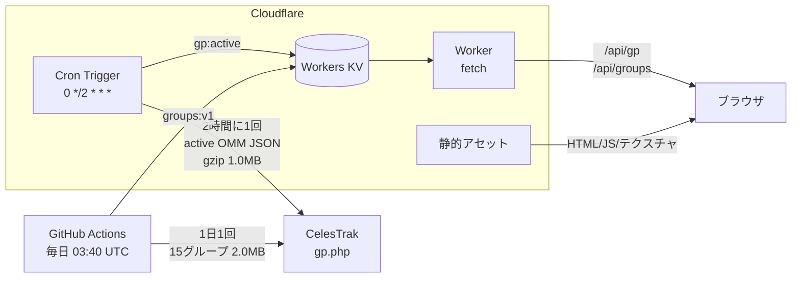

# 衛星トラッカー制作記録

CelesTrak の実測軌道要素をもとに、いま地球を回っている 16,400 基の人工衛星を
3D でリアルタイム表示する Web アプリを、ゼロから作って公開するまでの全記録。

- 公開先: https://satellite-tracker.yasukofu011.workers.dev
- リポジトリ: https://github.com/minerjirou/Satellite-Tracker
- 規模: TypeScript / TSX / JS / CSS 合計 約 **5,300 行**
- 制作日: 2026年8月20日〜21日

---

## 目次

1. [要件の確定](#1-要件の確定)
2. [調査 — 設計を決めたのは実測値だった](#2-調査--設計を決めたのは実測値だった)
3. [アーキテクチャ](#3-アーキテクチャ)
4. [実装](#4-実装)
5. [遭遇した問題と対処](#5-遭遇した問題と対処)
6. [検証](#6-検証)
7. [デプロイ](#7-デプロイ)
8. [数字で見る成果物](#8-数字で見る成果物)
9. [振り返り](#9-振り返り)

---

## 1. 要件の確定

最初のご依頼は「CelesTrak のデータをもとに人工衛星を地球の3Dモデルの周りを周回させる」「Vercel か Cloudflare にデプロイ」「GitHub で版管理」の3点でした。
実装方針が大きく変わる分岐だけを、着手前に確認しました。

| 確認事項 | 選択 |
|---|---|
| デプロイ先 | **Cloudflare**（Workers + KV + Cron Trigger） |
| 表示規模 | **全件 + LOD**（Starlink 含む。カメラ距離に応じた間引き） |
| 機能範囲 | 基本セット / 検索・クリック詳細 / 軌道線・地上軌跡 / ISSライブ・可視パス（全部） |
| GitHub | gh CLI を導入して自動作成 |

制作途中で追加のご要望が2件ありました。

- **Cloudflare 公式 MCP サーバーの導入** — 15種のうち本件で実際に使う5つ（docs / bindings / observability / builds / browser）をプロジェクトスコープで登録
- **グループ所属は CelesTrak から実取得する** — 当初計画では帯域を惜しんで名前から推測する方針だったが、権威的なデータを使う方針に変更

この2つ目の変更が、後述する「TLE 本体とグループ所属を分離する」設計に繋がりました。

---

## 2. 調査 — 設計を決めたのは実測値だった

コードを書く前に、CelesTrak と Cloudflare の制約をすべて実測しました。
**この段階で判明した数字が、アーキテクチャをほぼ一意に決めています。**

### 2.1 CelesTrak を直接叩けるか

まず CORS を確認したところ、`Origin` ヘッダを付けると `Access-Control-Allow-Origin: *` が返りました。
技術的にはブラウザから直接叩けます。

ところが**同じセッションで2回目のリクエストを投げると即座に 403** が返りました。本文はこうです。

```
GP data has not updated since your last successful
download of GROUP=active at 2026-08-20 16:43:52 UTC.
Data is updated once every 2 hours.
```

つまりレート制限は「時間」ではなく**「データが更新されたかどうか」**に連動しています。
ドキュメントにも次の制限が明記されていました。

- 1 更新サイクル（2時間）につき GROUP ごとに 1 ダウンロード
- 100MB/日 を超えると IP をファイアウォールでブロック
- 403/404 を 2 時間に 50 回出しても同様にブロック
- 403/404 は自然に解消しないので、クライアントは停止して人間に知らせること

**結論: ブラウザ直叩きの設計はリロード2回目で壊れる。** サーバ側で取得回数を構造的に1回へ固定する必要があります。

### 2.2 データのサイズと形式

| 形式 | サイズ | 備考 |
|---|---|---|
| `GROUP=active&FORMAT=json` | 6.9 MB | OMM JSON。生サイズは大きいが gzip でほぼ差が無い（後述） |
| `GROUP=active&FORMAT=3le` | **2.70 MB** | 名前行 + TLE 2行。この時点で採用 |
| `GROUP=active` の件数 | 16,073 基 | |

> **この選択は後で覆ります。** 3LE ではカタログ番号 10 万以上の物体が落ちることに
> 気づかず、327 基を取りこぼしていました。また「生サイズだけで JSON を却下した」のも
> 早計で、圧縮後で比べると差はほぼありませんでした。
> 詳細は [5.7](#57-last-30-days-が常に空--実は形式の問題だった) を参照。

グループ別の実測値（`FORMAT=2le`）:

| グループ | 件数 | サイズ |
|---|---|---|
| `starlink` | 10,746 | 1.5 MB |
| `oneweb` | 651 | 92 KB |
| `geo` | 568 | 81 KB |
| `gnss` | 170 | 24 KB |
| 残り11グループ | — | 合計で数百KB |

**全15グループ合わせても約2.0MB** と分かったのが重要でした。グループ所属を実取得しても帯域は問題にならない、という判断の根拠になっています。

なお `last-30-days` は `404` + 本文 `No GP data found` を返しました。このとき私は「グループ名は正しく、単に該当データが無い状態」と判断しました。**この見立ては誤りでした**（[5.7](#57-last-30-days-が常に空--実は形式の問題だった)）。

### 2.3 Cloudflare Workers 無料プランの制約

ここで設計を決定づける事実に当たりました。

| 項目 | 無料プラン |
|---|---|
| CPU 時間 / HTTP リクエスト | 10 ms |
| **CPU 時間 / Cron Trigger** | **10 ms** |
| サブリクエスト / 呼び出し | 50 |
| KV 読み取り | 10万/日 |
| KV 書き込み | 1,000/日 |
| KV 値サイズ上限 | 25 MiB |
| Cron Triggers | 利用可（アカウント5個まで） |
| 静的アセット | 20,000ファイル / 1ファイル 25MiB |

当初は「cron なら CPU 制限は緩いだろう」と考えていましたが、**ドキュメントには `CPU time per Cron Trigger: Free 10 ms` と明記**されていました。
ネットワーク待ち（`fetch`・KV I/O）は CPU 時間に計上されないので、「取ってきて右から左に流す」だけなら通ります。しかし **2MB のテキストを解析する処理は確実に超えます。**

もうひとつ、`caches.default`（Cache API）は `*.workers.dev` では機能しないことも確認しました。キャッシュ層は KV に一本化しています。

### 2.4 ライブラリの実力を測る

satellite.js の最新版（7.1.0）を調べたところ、想定より遥かに強力でした。

- `BulkPropagator` — **WASM による一括伝播**
- `sunPos` / `shadowFraction` — 太陽位置と本影・半影の計算が内蔵
- `json2satrec` — OMM JSON から直接 satrec を構築
- `communityDecayCheckEnabled` — 再突入済み衛星を正しく「消滅」と報告するオプション

実際に ISS の実データでベンチマークを取りました。

```
=== ISS (25544) 正確性チェック ===
地心距離      : 6788.5 km
高度(測地)    : 418.6 km   [期待 400-430]
速度          : 7.666 km/s [期待 ~7.66]
周期          : 92.94 分   [期待 ~92.9]

=== WASM vs 純JS の一致 ===
差   : 0.000000 m

=== 13000 基のスループット ===
WASM BulkPropagator (1 時刻)  2.85 ms/回
純JS propagate() ループ         5.40 ms/回
```

**当初の計画では「13,000基の SGP4 は 1回あたり約80ms かかるので、5Hz でサンプリングして線形補間するしかない」と見積もっていました。実測は 2.85ms で、28倍の乖離でした。**
この1回のベンチマークが、後述する伝播アーキテクチャを丸ごと書き換えることになります。

---

## 3. アーキテクチャ

### 3.1 全体像



### 3.2 なぜこの形なのか

**「取得回数を構造的に1回へ固定する」** — CelesTrak のレート制限は、ブラウザから直接叩く設計を許しません。Cron Trigger が2時間に1度だけ取得して KV に置き、クライアントは KV を読むだけにします。利用者が何人来ても CelesTrak への負荷は一定です。

**「更新頻度と処理の重さで実行場所を分ける」** — 軌道要素は2時間ごとに変わりますが、**グループ所属は新規打ち上げのときにしか変わりません。** この2つを分離すると、

- 頻繁で軽い軌道要素本体 → Worker の Cron Trigger（バイト列を KV に流すだけ）
- 低頻度で重いグループ集計 → GitHub Actions（CPU 制限なし）

という配置になり、**Cloudflare 無料プランのまま**運用できます。

### 3.3 帯域収支

| データ | サイズ | 頻度 | 実行元 | 日次 |
|---|---|---|---|---|
| `active` OMM JSON | 1.01 MB | 12回/日 | Cloudflare Worker | 12.1 MB |
| グループ15種 OMM JSON | 約 1.0 MB | 1回/日 | GitHub Actions | 1.0 MB |
| **合計** | | | | **約 13 MB/日** |

いずれも gzip 転送後の実測値です。

CelesTrak の 100MB/日 制限に対して十分な余裕があります。
副次的な利点として、**実行元 IP が分かれるため片方の制限がもう片方に波及しません。**

### 3.4 Worker がやらないこと

CPU 10ms を守るため、Worker の責務は極端に絞りました。

```ts
// これだけ
const buf = await res.arrayBuffer();      // ← res.text() は使わない
await env.SATCACHE.put(KEY_GP, buf, { metadata });

// 返すときも
const cached = await env.SATCACHE.getWithMetadata(KEY_GP, { type: 'stream' });
return new Response(cached.value, { headers });
```

`res.text()` や `res.json()` を避けているのは、**7MB のデコードとパースだけで CPU 予算を使い切る**からです。`arrayBuffer()` ならバイト列のコピーだけで済みます。

同じ理由で「衛星の件数」も Worker では数えていません。行数を数えるには全走査が必要だからです。件数はクライアントがパース時に算出して表示します。

`/api/meta` で更新時刻を返すときも、`KV.list()` が**値を読まずに metadata だけ返す**性質を使い、7MB の本体を一切ロードせずに済ませています。

---

## 4. 実装

### 4.1 ディレクトリ構成

```
Satellite-Tracker/
├── worker/index.ts              # Cloudflare Worker: fetch(/api/*) + scheduled(cron)
├── src/
│   ├── main.tsx
│   ├── app/
│   │   ├── App.tsx              # 画面レイアウト
│   │   └── useTracker.ts        # Worker・シーン・React の配線をすべて集約
│   ├── scene/
│   │   ├── SceneRoot.ts         # renderer / camera / OrbitControls / ループ
│   │   ├── Earth.ts             # 昼夜シェーダ球体
│   │   ├── Atmosphere.ts        # フレネル加算グロー
│   │   ├── Starfield.ts         # 手続き生成の星空
│   │   ├── SatelliteField.ts    # 単一 Points + LOD シェーダ
│   │   ├── OrbitLine.ts         # 軌道線・地上軌跡
│   │   └── picking.ts           # スクリーン空間の最近傍探索
│   ├── workers/
│   │   ├── propagator.worker.ts # SGP4 一括計算・パス予測
│   │   └── protocol.ts          # メッセージ型定義
│   ├── data/{api,groups}.ts
│   ├── lib/{units,clock,format}.ts
│   ├── shims/wasm-multi-thread-stub.ts
│   └── ui/                      # React オーバーレイ
├── scripts/
│   ├── build-groups.mjs         # 15グループ集計（GitHub Actions で実行）
│   └── fetch-textures.mjs       # NASA テクスチャ取得・縮小
├── public/textures/             # 生成済みテクスチャ（コミット済み）
├── .github/workflows/{ci,deploy,groups}.yml
└── wrangler.jsonc
```

### 4.2 座標系とスケール

深度バッファの精度を確保するため、**1 シーン単位 = 1,000 km** としました。地球半径 6.371、静止軌道 42.164 という扱いやすい数値になり、`near=0.01 / far=1000` の素直なカメラ設定で低軌道から静止軌道まで破綻なく描けます。

ECI（z が北極）から three.js（y が上）への割り当ては次のとおりです。

```
scene.x =  eci.x
scene.y =  eci.z
scene.z = -eci.y
```

地球メッシュは地球固定（ECF）の向きで作り、**GMST の分だけ Y 軸まわりに回して**慣性系のシーンに置いています。地上軌跡は地球と一緒に回る必要があるので、地球メッシュの子グループに入れました。

three.js の `SphereGeometry` は、既定の UV と正距円筒図法テクスチャの組み合わせで `u=0.5` がちょうど経度0°に対応します。自前の測地座標変換と整合するため、海岸線と地上軌跡がずれません。

### 4.3 伝播 — 実測がアーキテクチャを変えた

当初計画は「Worker で 5Hz サンプリング → メインスレッドで線形補間」でした。しかし補間には**次のサンプルが必要**なため、常に1サンプル分（200ms）遅れた映像になります。

実測で伝播が 2.85ms と分かったので、設計を変えました。

**Worker が 20Hz で位置と速度を計算し、メインスレッドは速度ベクトルで1次外挿する。**

```ts
out[o] = base[o] + vel[o] * dtSeconds;
```

50ms 先の外挿誤差は、向心加速度から見て約1cm です（8.7 m/s² × 0.05² ÷ 2）。
**補間のために1フレーム遅らせるより素直で、しかも遅延がありません。**

バッファは transferable として渡し、メインスレッドが使い終わったら Worker に返却して再利用します（ping-pong 方式）。16,073 基 × 3成分 × 2種類 で約 386KB を 20Hz でやり取りするため、コピーもアロケーションも避けたい部分です。

WASM の初期化に失敗した場合は純 JS の伝播に自動フォールバックします（5.40ms なので実用上の差はほぼありません）。

### 4.4 描画 — 単一 Points とビット演算フィルタ

16,073 基を個別の Mesh にするとドローコールで破綻するので、**単一の `THREE.Points`** にまとめ、カスタムシェーダで色・サイズ・表示可否を出し分けています。

頂点属性:

| 属性 | 型 | 更新頻度 |
|---|---|---|
| `position` | vec3 | 毎フレーム |
| `aLit` | float | サンプル毎（日照/影） |
| `aColor` | vec3 | 初回のみ |
| `aSize` | float | 初回のみ |
| `aMask` | **int** | 初回のみ |
| `aThin` | float | 初回のみ |

グループの絞り込みは**シェーダ内のビット演算**で行っています。

```glsl
if (!selected && (aMask & uFilterMask) == 0) {
    gl_Position = vec4(2.0, 2.0, 2.0, 1.0);  // クリップ空間外へ飛ばす
    gl_PointSize = 0.0;
    return;
}
```

WebGL2（GLSL ES 3.0）の整数属性を使っているので、チェックボックスの操作は **uniform 1つの更新**で完了します。CPU 側でジオメトリを組み直す必要がありません。

遠景での間引きも同じ仕組みです。`starlink` / `oneweb` / `kuiper` / `qianfan` のビットが立った衛星だけを対象にし、カメラ距離に応じて `uThinThreshold` を上げます。有人・GNSS・選択中の衛星は常に全数表示されます。

ピッキングは GPU ピッキングを使わず、現在位置を CPU でスクリーン投影して最近傍を探しています。**16,073点の投影は実測 0.049ms** で、「クリック位置に一番近い点」という直感的な当たり判定になるため、点が小さくても掴めます。地球の裏側にある点は線分と球の最近接距離で除外しています。

### 4.5 分類 — 公式グループを正とする

**名前からの推測は一切していません。** GLONASS 衛星の名前は `COSMOS 2569` のようになっていて、他の COSMOS 衛星と区別できないためです。

15グループを 32bit のビットマスクで保持しており、1基が複数グループに属する状態をそのまま表現できます。実際、ISS には「宇宙ステーション」「肉眼可視」「アマチュア無線」の3つが同時に立ちます。

表示色は優先順位で1つに決めます（`stations` > `starlink` > `oneweb` > … > `visual`）が、フィルタはマスクの AND で動くため、表示色とは独立に絞り込めます。

ビット位置はサーバから受け取った `names` 配列から**実行時に組み立てて**います。定数として焼き込んでいないので、サーバ側でグループを追加してもクライアントを直さずに追従できます。

### 4.6 可視パス予測

観測地から今後48時間を30秒刻みで走査し、仰角が0°を跨ぐ点を**二分法で1秒まで詰め**、最大仰角の時刻は**黄金分割探索**で精緻化しています。仰角10°以上のパスだけを列挙します。

「肉眼で見えるか」は2条件の AND で判定しています。

- 衛星が日照中（`shadowFraction < 0.5`）
- 観測地の太陽高度が −6°未満（市民薄明より暗い）

太陽高度は `sunPos` の結果を ECI→ECF 変換して観測地からの仰角を取って求めています。

### 4.7 テクスチャ

NASA のパブリックドメイン素材を使い、`scripts/fetch-textures.mjs` で一度だけ取得・縮小して**成果物をリポジトリにコミット**しました。ビルドのたびに NASA のサーバへ取りに行くと、向こうが落ちているだけでビルドが壊れるためです。

| 出力 | 元データ | 処理 |
|---|---|---|
| `earth_day.jpg` | Blue Marble 5400×2700 (2.45MB) | 4096×2048 / q82 → **835 KB** |
| `earth_night.jpg` | Earth at Night 3600×1800 (0.76MB) | 2048×1024 / q80 → **109 KB** |

**5400px の元画像はモバイル GPU の最大テクスチャサイズ（多くは4096）を超えるため、縮小は必須**でした。mozjpeg を通したことで、計画時の見積もり（数MB）より大幅に小さく収まっています。

星空はテクスチャを使わず手続き生成しています。球面上の一様分布（高さを一様に取る）で、明るさは `random()^2.4` の分布にして「暗い星ほど多い」自然な密度にしました。決定的な擬似乱数を使っているので、リロードしても星座は変わりません。

---

## 5. 遭遇した問題と対処

時系列で13件ありました。設計に関わるものを太字にしています。

### 5.1 npm 11 の install スクリプト承認ゲート

`npm install` が esbuild と workerd の postinstall をブロックしました。npm 11 から導入された仕組みです。

```
npm warn allow-scripts 2 packages have install scripts not yet covered by allowScripts
```

`npm approve-scripts esbuild workerd` で承認し、`package.json` に `allowScripts` として記録されました。実際には両パッケージともプラットフォーム別バイナリが optionalDependencies として入るため、承認しなくても動く状態でしたが、明示的に許可しておくのが正しい対処です。

### 5.2 @cloudflare/workers-types が v5 になっていた

`^4.x` を指定したら `ETARGET`。確認すると最新は `5.20260820.1` でした。バージョンを推測で書かず、`npm view` で実際の最新版を確認してから指定するようにしました。

### 5.3 **Vite が Worker を iife で出力する**

ビルドが次のエラーで落ちました。

```
[UNSUPPORTED_FEATURE] Top-level await is currently not supported with the 'iife' output format
  node_modules/satellite.js/wasm-build/pthreads-release/index.js
```

Vite は Web Worker を既定で iife 形式にバンドルしますが、Emscripten の WASM ローダーはトップレベル await を使います。`{ type: 'module' }` で起動しているので、`worker: { format: 'es' }` を指定して解決しました。

### 5.4 **未使用の pthreads 版 WASM が引き込まれる**

上のエラーで気づいたのですが、satellite.js の index が `createMultiThreadRuntime` を re-export しており、その中の `await import('#wasm-multi-thread')` をバンドラが辿っていました。

pthreads 版は SharedArrayBuffer を要求する = ページに **COOP/COEP ヘッダを立てて cross-origin isolation を有効にしないと動きません**。単一スレッドで十分な性能が出ているので、Vite の alias でスタブに差し替え、130KB 超の未使用コードを排除しました。

```ts
resolve: {
  alias: [{ find: /^#wasm-multi-thread$/, replacement: multiThreadStub }],
}
```

### 5.5 **マスク0バグ — 衛星が1基も表示されない**

最初にブラウザで開いたとき、地球と星空は完璧に描画されているのに**衛星が1基も見えませんでした。** コンソールにエラーはなし。時刻表示は進んでおり、フレームは届いていました。

原因は分類ロジックにありました。

- CelesTrak のグループはカタログ全体を覆っていない
- テストデータでは 3,233 基中 **2,894 基がどのグループにも属さない**
- それらのマスクは `0`
- シェーダの `(aMask & uFilterMask) == 0` に全部一致してしまい、**捨てられる**

残った 339 基は GNSS と静止軌道の衛星で、これらは初期カメラの画角外にいたため、結果として画面には何も出ませんでした。

対処として **「その他（グループ未収載）」の合成ビット**を導入しました。`GroupIndex.maskFor()` が 0 を返すことは無くなり、フィルタ UI にも1項目として現れます。これらの衛星だけは軌道の形（低軌道 / 中軌道 / 静止 / 長楕円）で色分けしています。

**これは設計の穴でした。** 「グループ所属を正とする」という判断は正しかったのですが、「グループが全件を覆っている」という暗黙の前提が誤っていました。

### 5.6 `ids.size` — Array に `.size` を使っていた

集計スクリプトの出力が `undefined 件` になりました。ループ内の `ids` は Set、出力時の `ids` は Array で、同じ名前を使っていたためです。`.length` に修正しました。

### 5.7 **`last-30-days` が常に空 — 実は形式の問題だった**

```
HTTP 404, bytes=16
No GP data found
```

このときは「グループ名は正しいが、たまたま該当データが無い状態」と判断し、
`404` かつ本文が `No GP data found` のときは空集合として正常処理するようにしました。
これ自体は必要な対処でしたが、**原因の見立てが誤っていました。**

公開後、ユーザーから「`table.php?GROUP=last-30-days` なら見られるのでは」という指摘を受けて
調べ直したところ、HTML の閲覧ページは 200 で **215 件**を表示しており、
そのカタログ番号がすべて **100129 以降の 6 桁**でした。

形式を変えて切り分けると、はっきりしました。

| クエリ | 結果 |
|---|---|
| `GROUP=last-30-days&FORMAT=3le` | 404 `No GP data found` |
| `GROUP=last-30-days&FORMAT=json` | **200**（215 件） |
| `CATNR=100129&FORMAT=3le` | 404 `No GP data found` |
| `CATNR=100129&FORMAT=json` | **200** |

**CelesTrak はカタログ番号 10 万以上の物体に対して TLE 系形式を出力しません。**
TLE のカタログ番号欄は 5 桁しかないためです。データが無いのではなく、
**こちらが要求していた形式では表現できなかった**、というのが真相でした。

影響は `last-30-days` に留まりませんでした。

| 形式 | `active` の件数 | サイズ |
|---|---|---|
| `FORMAT=3le`（当時使用） | 16,073 | 2.70 MB |
| `FORMAT=csv` | **16,400** | **2.48 MB** |

**327 基が丸ごと欠落していました。しかも CSV の方が小さい。**
欠落していたのは直近の打ち上げと新しい Starlink — いちばん見たいものです。

対処として、データ形式を **OMM (Orbit Mean-Elements Message)** の JSON 表現へ移行しました。
OMM は CCSDS 502.0-B-3 で定義された軌道要素の交換形式で、TLE の後継にあたります。

一度は CSV を採用しましたが、最終的に JSON にしています。判断材料は転送量の実測でした。

| 形式 | 件数 | 生サイズ | gzip 後 | 日次(12回) |
|---|---|---|---|---|
| `FORMAT=3le` | 16,073 | 2.70 MB | — | — |
| `FORMAT=csv` | 16,400 | 2.36 MB | 0.83 MB | 9.96 MB |
| `FORMAT=json`（採用） | **16,400** | 7.04 MB | **1.01 MB** | **12.09 MB** |

生サイズだけ見ると JSON は CSV の 3 倍で、当初は帯域を理由に CSV を選びました。
しかし CelesTrak が `Content-Encoding: gzip` を返すことを確認（46,632B → 8,335B）したうえで
圧縮後で比べ直すと、**差はほぼ消えます**。項目名が繰り返し現れる JSON はよく圧縮されるためです。

そうであれば、自己記述的で CelesTrak が項目を増減しても壊れない JSON の方が堅い、という判断です。

変更点:

- Worker: `FORMAT=3le` → `FORMAT=json`、KV キーとエンドポイントも `gp:active` / `/api/gp` に改名
- 伝播 Worker: `twoline2satrec` による桁位置パース → OMM レコードをそのまま `json2satrec` へ
  （Alpha-5 デコードもエポックの YYDDD 変換も不要になり、パーサは大幅に短くなった）
- グループ集計: `FORMAT=2le` → `FORMAT=json`
- 詳細パネル: 生 TLE 2 行の表示 → OMM 全フィールドの表示

移行後、実データ 16,400 件すべてが伝播に成功することを確認しました（失敗 0）。
本番では Cloudflare が zstd で 1.13MB まで圧縮して配信しています。
グループ件数も全面的に回復しています。

| グループ | 移行前 | 移行後 |
|---|---|---|
| `last-30-days` | 0 | **215** |
| `starlink` | 10,746 | **10,975** |
| `stations` | 21 | **22** |
| 所属データ合計 | 13,321 | **13,617** |

**この件は「404 を素直に受け取りすぎた」失敗でした。** 空集合として正常処理する対処は
挙動としては正しかったのですが、そこで満足せず「なぜ空なのか」を追うべきでした。
HTML の閲覧ページと API で結果が食い違っているという事実が、そのまま答えへの入口でした。

### 5.8 Windows での「直接実行判定」

```js
if (import.meta.url === `file://${process.argv[1].replace(/\\/g, '/')}`)
```

Windows では `import.meta.url` が `file:///C:/...`（スラッシュ3本）になるため一致しません。`pathToFileURL(process.argv[1]).href` に置き換えました。

### 5.9 **`/__scheduled` が SPA フォールバックに飲まれる**

cron 経路をローカルで検証しようとしたところ、`wrangler dev --test-scheduled` の入口が動きませんでした。

```
GET /__scheduled 200 OK `Sec-Fetch-Mode: navigate` header present
  - using `not_found_handling` behavior
```

`not_found_handling: "single-page-application"` が `/__scheduled` を index.html で握り潰していました。`run_worker_first` に追加して Worker 側へ回すことで解決しています。本番では単に 404 を返すだけなので害はありません。

これを直したことで、**一番壊れてほしくない挙動**を実地で確認できるようになりました（後述）。

### 5.10 軌道線が選択のたびに復活する

軌道線を消しておいて別の衛星を選ぶと、線が勝手に復活していました。`Trail.set()` が無条件に `visible = true` にしていたためです。「ユーザーが表示したがっているか」を Trail 側で保持するよう修正しました。

### 5.11 ドラッグの終わりで衛星を選択してしまう

地球を回すドラッグの終点に衛星があると、選択されてしまいました。`pointerdown` の位置を記録し、移動量が 5px を超えたクリックは無視するようにしました。

### 5.12 検索で毎キーストローク 16,000 件を大文字化

`names[i].toUpperCase()` をループ内で呼んでいたため、1打鍵ごとに16,000個の文字列を確保していました。カタログ受信時に一度だけ大文字化した配列を作るよう変更。

同時に、NORAD ID の完全一致判定を数字のみの入力に限定しました。`parseInt("1998-067A")` は `1998` を返すため、国際識別符号を打つと無関係な衛星が先頭に来ていたためです。

### 5.13 gh の OAuth トークンに workflow スコープが無い

リポジトリ作成は成功しましたが push が拒否されました。

```
! [remote rejected] HEAD -> main (refusing to allow an OAuth App to create or
  update workflow `.github/workflows/ci.yml` without `workflow` scope)
```

`gh auth refresh --hostname github.com -s workflow` でスコープを追加して解決。非対話環境では `--hostname` が必須でした。

---

## 6. 検証

### 6.1 軌道計算の正確性 — 独立実装との照合

最も重要な検証です。**別実装の SGP4 を使っている [wheretheiss.at](https://wheretheiss.at/) と、同一時刻で ISS の位置を突き合わせました**（2026-08-20 18:14:57 UTC）。

| | 本アプリ | wheretheiss.at | 差 |
|---|---|---|---|
| 緯度 | 5.021°N | 5.0003°N | **0.021°** |
| 経度 | 101.628°E | 101.613°E | **0.015°** |
| 高度 | 415.8 km | 415.77 km | **0.03 km** |
| 速度 | 7.665 km/s | 27592.96 km/h (= 7.665 km/s) | 一致 |
| 日照状態 | 地球の影（本影） | `eclipsed` | 一致 |

残差の大部分は読み取り時刻のずれで説明できます（ISS は 0.4 秒で 0.03° 進む）。
当初の判定基準は「誤差1°以内」でしたが、実際には **0.02°** に収まりました。

### 6.2 軌道要素ごとの妥当性

| 衛星 | 項目 | 結果 | 期待値 |
|---|---|---|---|
| ISS (25544) | 周期 | 92.93 分 | ~92.9 |
| | 高度 | 415.8 km | 400–430 |
| | 傾斜角 | 51.63° | 51.6 |
| GPS BIIR-5 (26407) | 周期 | **718.00 分** | 11h58m = 718 |
| | 傾斜角 | 54.84° | ~55 |
| | 高度 | 20,452 km | ~20,200（e=0.0119 で変動） |
| | 速度 | 3.837 km/s | ~3.87 |
| LEMUR-1 (40044) | 高度 | 597 km | ~600 |
| | 傾斜角 | 97.80° | 太陽同期 |
| | 周期 | 96.94 分 | ~97 |

### 6.3 可視パスの妥当性

東京（35.681°N, 139.767°E）から見た LEMUR-1 のパス:

```
8/21 03:21  12分40秒  最大 30°
南 (191°) → 西 (263°) → 北北西 (336°)
```

継続時間を球面幾何で検算しました。高度600kmの地平線central angle は `acos(6371/6971) = 24.1°`、仰角30°となるのは `γ ≈ 7.6°`。弦の角長は `2·acos(cos24.1°/cos7.6°) = 45.8°`、軌道の角速度 `360°/96.94min = 3.714°/min` で割ると **12.3 分**。実測 12分40秒と一致します。

方位も、極軌道衛星が東京上空を通る場合として妥当です。

### 6.4 昼夜境界

17:32 UTC のスクリーンショットで、ターミネータが西アフリカ（約7°E）に位置していました。
太陽直下点は `(12 - 17.53) × 15 = -83°` = 83°W、ターミネータはその90°東の **7°E**。一致します。

### 6.5 cron の障害時挙動

**一番壊れてほしくない挙動**です。CelesTrak が403を返す状態で cron を手動発火させました。

```json
{
  "tle": { "fetchedAt": "2026-08-20T17:31:46Z", "bytes": 543144 },
  "lastRun": { "lastRunAt": "2026-08-20T17:48:49.953Z", "ok": false, "error": "HTTP 403" }
}
```

```
✘ [ERROR] CelesTrak returned HTTP 403; keeping previous KV value
```

**既存データは保持され、エラーは記録され、リトライはしない。** 設計通りです。
CelesTrak は403の連打を IP ブロックの対象にしているため、リトライしないことが重要です。

同様に、応答が 100KB 未満だった場合（エラーページ等）も KV を上書きしません。

### 6.6 グループ集計の部分障害

初回実行時、たまたま `starlink` が403、`last-30-days` が404という状態で走りました。**これが期せずして部分障害のテストになりました。**

```
starlink       失敗: HTTP 403 — 前回分を保持します
last-30-days   失敗: HTTP 404 — 前回分を保持します
（他13グループは成功）
```

その後 CelesTrak の更新サイクルが回ってから `--previous` 付きで再実行したところ、全15グループが成功し、前回データとマージされました。

```
starlink        10746 基
oneweb            651 基
...
groups.json を書き出しました: 13321 件 / 119.5 KB
```

### 6.7 グループ件数の照合

UI に表示される件数が、CelesTrak から直接測った値と完全に一致することを確認しました。

| グループ | UI 表示 | CelesTrak 直接計測 |
|---|---|---|
| Starlink | 10,746 | 10,746 |
| OneWeb | 651 | 651 |
| 静止軌道 | 568 | 568 |
| 測位 (GNSS) | 170 | 170 |

また ISS に「宇宙ステーション」「肉眼可視」「アマチュア無線」の3タグが同時表示されることで、ビットマスクによる複数所属の保持も確認できました。

### 6.8 性能

| 処理 | 13,000基あたり | 頻度 |
|---|---|---|
| WASM `BulkPropagator` での伝播 | 2.85 ms | 20Hz（Worker） |
| 純 JS フォールバック | 5.40 ms | 同上 |
| メインスレッドの位置外挿 | **0.028 ms** | 毎フレーム |
| ピッキング用の全点投影 | 0.049 ms | 20Hz |

メインスレッドが毎フレーム負担するのは 0.03ms 未満（16.7ms 予算の 0.2%）で、残りは GPU の描画（点は1ドローコール）と1フレームあたり約190KBの属性転送だけです。

**実 FPS は計測できていません。** ブラウザ自動操作ではウィンドウが非フォアグラウンド扱いになり `requestAnimationFrame` が絞られるためです。フォアグラウンドのブラウザでの確認が必要です。

### 6.9 本番環境

デプロイ直後、KV が空の状態で `/api/gp`（当時は `/api/tle`）にアクセスしました。

```
x-source: origin        ← フォールバックで CelesTrak から取得
objects: 16073
```

2回目:

```
x-source: kv            ← ctx.waitUntil で KV が埋まっている
```

初回アクセス時のフォールバック経路が正しく機能し、KV が自動的に埋まることを確認しました。

---

## 7. デプロイ

### 7.1 Cloudflare

```bash
npx wrangler login
npx wrangler kv namespace create SATCACHE
# → id を wrangler.jsonc に記入
npm run build && npx wrangler deploy
```

```
env.SATCACHE (ee050ee0c16140f3ac20ddfb72417e2f)      KV Namespace
env.ASSETS                                           Assets
Uploaded satellite-tracker (3.89 sec)
Deployed satellite-tracker triggers (1.01 sec)
  https://satellite-tracker.yasukofu011.workers.dev
  schedule: 0 */2 * * *
```

### 7.2 GitHub

```bash
gh auth login
gh repo create Satellite-Tracker --public --source . --remote origin --push
```

workflow スコープの追加が必要でした（5.13 参照）。

### 7.3 GitHub Actions

3本のワークフローを用意しました。

| ファイル | トリガー | 内容 |
|---|---|---|
| `ci.yml` | push / PR | `tsc --noEmit` × 2構成 + `vite build` |
| `deploy.yml` | main への push | `wrangler-action@v3` でデプロイ |
| `groups.yml` | 毎日 03:40 UTC + 手動 | グループ集計 → `wrangler kv key put` |

`groups.yml` は前回の `groups.json` を KV から取得してマージするため、**あるグループが一時的に取得できなくても前回分が保持**されます。全グループ失敗時のみ job を fail させ、KV は書き換えません。

シークレット未登録でもアプリ本体は動きます（`/api/groups` が 204 を返し、軌道の形による分類にフォールバック）。実装とデプロイをブロックしない設計です。

---

## 8. 数字で見る成果物

### ソースコード

| ファイル | 行数 |
|---|---|
| `src/workers/propagator.worker.ts` | 768 |
| `src/styles.css` | 746 |
| `src/app/useTracker.ts` | 620 |
| `src/scene/SceneRoot.ts` | 326 |
| `src/scene/SatelliteField.ts` | 298 |
| `src/data/groups.ts` | 244 |
| `worker/index.ts` | 238 |
| `scripts/build-groups.mjs` | 226 |
| その他 19 ファイル | 1,843 |
| **合計** | **5,309** |

### ビルド成果物

| ファイル | サイズ | gzip |
|---|---|---|
| `index-*.js`（three.js + React + アプリ） | 780.7 KB | 211.4 KB |
| `base-release-*.js`（WASM、遅延ロード） | 152.1 KB | — |
| `propagator.worker-*.js` | 41.6 KB | — |
| `index-*.css` | 8.7 KB | 2.5 KB |
| `earth_day.jpg` | 835 KB | — |
| `earth_night.jpg` | 109 KB | — |

WASM チャンクは伝播 Worker の初期化時にのみ読み込まれ、初期表示をブロックしません。

### コミット

```
3d4ebd5  CelesTrak の実データで衛星を 3D 表示するアプリを作成
69d4671  UI の取り回しを修正
f0645b1  wrangler dev --test-scheduled で cron 経路を叩けるようにする
6c9850b  実データ 16,073 基での検証結果を README に反映
ad0ee7b  本番の KV namespace id を設定
```

---

## 9. 振り返り

### 9.1 計画から実際に変わった点

| | 計画 | 実際 |
|---|---|---|
| 伝播の速度 | 13,000基で約80ms | **2.85ms**（WASM）/ 5.40ms（純JS） |
| 位置の中間フレーム | 5Hz サンプル間を線形補間 | **20Hz + 速度による1次外挿**（遅延ゼロ） |
| グループ分類 | 名前と軌道要素から推測 | **CelesTrak の公式グループを実取得** |
| 集計の実行場所 | Worker の cron B | **GitHub Actions**（cron も CPU 10ms のため） |
| cron の本数 | 2本 | 1本 |
| 対象件数 | 約13,000基 | 実際は **16,400基** |
| データ形式 | 3LE | **OMM JSON**（3LE では 327 基が落ちる） |
| テクスチャ | 数MB を想定 | mozjpeg で **944KB** に収まった |

### 9.2 事前の実測が効いた場面

**制約を推測ではなく実測で確かめたことが、設計の質を決めました。**

- CelesTrak の403を「実際に踏んで」確認したから、ブラウザ直叩き設計を最初から排除できた
- 「cron も CPU 10ms」をドキュメントで確認したから、Worker の責務を極限まで削れた
- ベンチマークを取ったから、遅延のある補間ではなく遅延ゼロの外挿を選べた
- グループ別サイズを測ったから、「グループ所属を実取得しても帯域は問題ない」と判断できた

逆に、**2 つの不具合はどちらも「測っていない前提」から出ました。**

- マスク0バグ — 「グループが全件を覆っている」という前提。実データを画面に出すまで気づけない類のもの
- 形式による欠落 — 「TLE は全件を表現できる」という前提。件数を別形式と突き合わせるまで気づけない

どちらも「取得できている件数が正しいか」を別の情報源で確かめていれば早く見つかりました。
**成功したレスポンスの中身を疑う**のは、失敗を検知するより難しい、という教訓です。
今回は 404 という明確な信号が出ていたにもかかわらず、それを「データが無い」と解釈して
先へ進んでしまいました。

### 9.3 残っている課題

**コールドスタート時の重複取得** — KV が空の状態に同時アクセスがあると、各リクエストが個別に CelesTrak を叩きます。実際にデプロイ直後、数秒の間に2回のフェッチが発生しました。デプロイ直後の数秒だけの現象で自己解消しますが、KV に短命のロックキーを置いて集約するのが望ましい状態です。CelesTrak は403の回数もブロック対象にしているため、大量アクセスがある環境では対処すべきです。

**実 FPS の未計測** — 6.8 のとおりです。

**古い形式の痕跡** — `docs/screenshot.jpg` は CSV 移行前（16,073 基）のものです。

### 9.4 使った外部データと出典

- **軌道要素**: [CelesTrak](https://celestrak.org/) — Dr. T.S. Kelso
- **地球テクスチャ**: NASA Earth Observatory — Blue Marble: Next Generation / Earth at Night（パブリックドメイン）
- **軌道計算**: [satellite.js](https://github.com/shashwatak/satellite-js) 7.1 — SGP4/SDP4
- **描画**: [three.js](https://threejs.org/) 0.185
- **照合先**: [wheretheiss.at](https://wheretheiss.at/) — 独立実装の SGP4

CelesTrak への負荷は2時間に1リクエストに抑えており、`User-Agent` にアプリ名とリポジトリ URL を名乗る同サイトの作法にも従っています。
